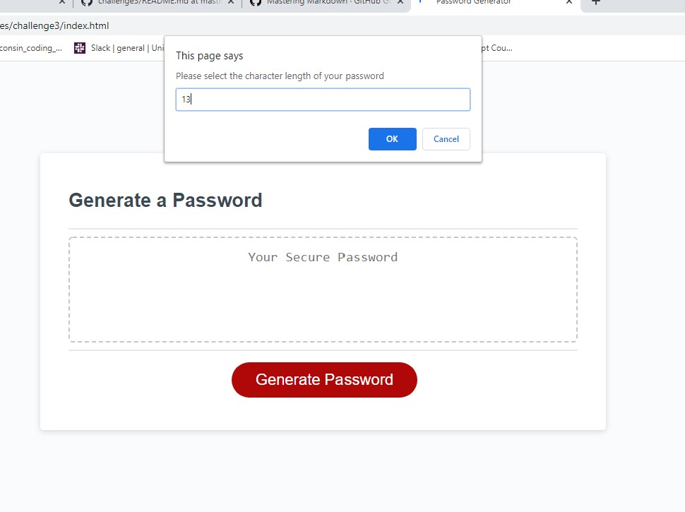

# Challenge 3:  *Create a Random Password Generator*

## What
For this challenge we were instructed to create a password generator that an employee could use to generate a random password based on information they would select.  

## Why
This type of password generator has real world functions for businesses that may need to frequently change passwords and must also have higher security type password.

## How
To create this password generator we used the following:

* HTML
* CSS
* JavaScript

## Links

**Link to github repository:**  https://github.com/sas1300/challenge3.git 

**URL:**  https://sas1300.github.io/challenge3/

# Screenshots

